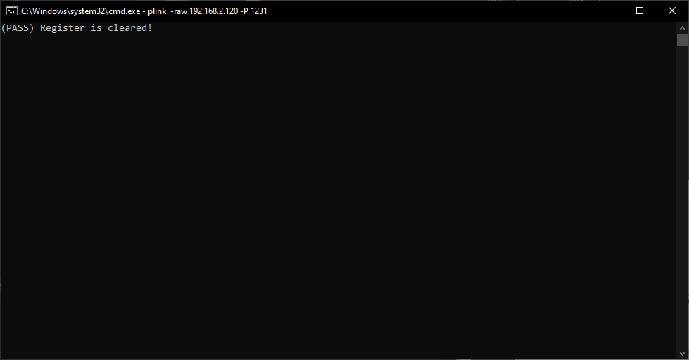
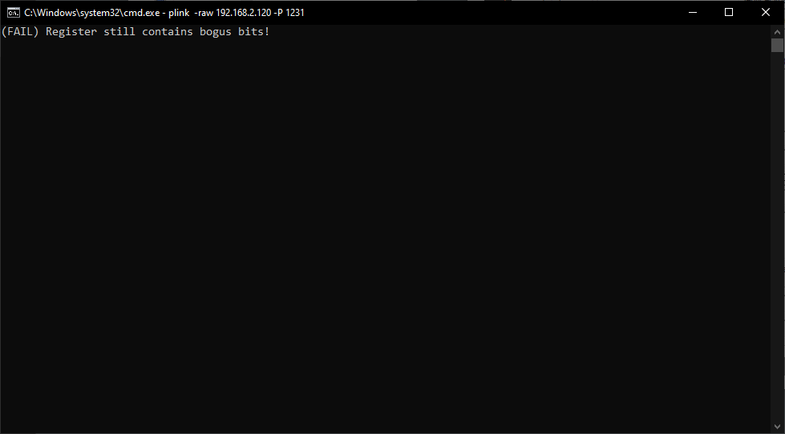

# VmdtStr
Detect VMMs with faulty handling of STR exit
# Showcase
This is the output on a KVM with no nested VMM active:


And this is with HVPP as a nested VMM:

# How it works
This demo works because some public VMMs don't emulate `STR` instruction correctly.
Let me quote the relevant part in the instruction set reference from Intel website:<br>
```
When the destination operand is a 32-bit register, the 16-bit segment selector is copied into the lower 16 bits of the
register and the upper 16 bits of the register are cleared. When the destination operand is a memory location, the
segment selector is written to memory as a 16-bit quantity, regardless of operand size.

In 64-bit mode, operation is the *same*. The size of the memory operand is fixed at 16 bits. In register stores, the 2-
byte TR is *zero extended* if stored to a 64-bit register.
```

# Disclaimer
This has been tested using HVPP and some other public VMMs, in a KVM virtual machine.<br>
Although i think the results on bare metal should be the same, more evaluation is required if this should be used legitimately.<br>
